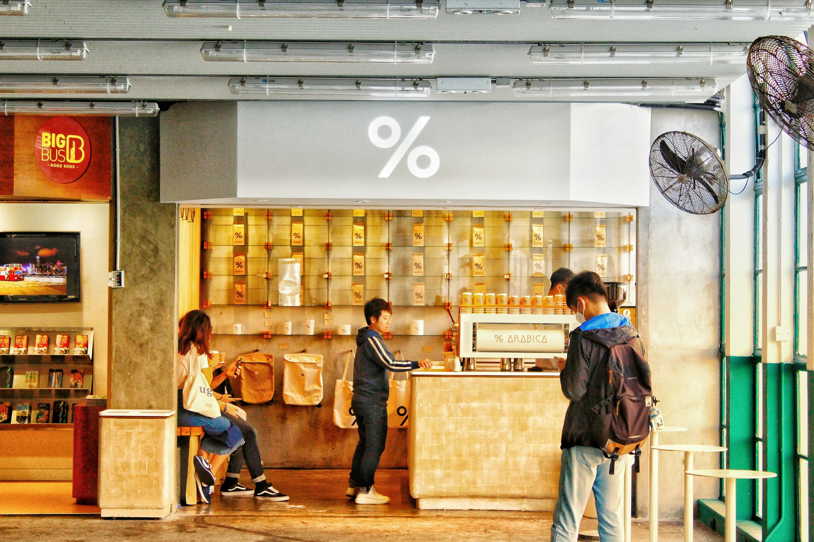
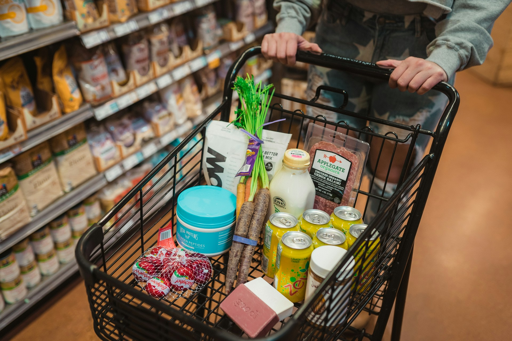

  

    <a href="rfm_1.html">
      
      
RFM Analyse

      </a>
      
Wie man mithilfe der RFM-Analyse im Onlinehandel High-Value-Kunden identifiziert

  

  

    <a href="pareto_1.html">
      
      
Pareto Diagramm

    </a>
      
Pareto trifft E-Commerce: Entlarvt die Datenanalyse den 80/20-Mythos?

  

  

    <a href="recency_1.html">
      
      
Recency Heatmap

    </a>
      
Kundenaktivität verstehen und nutzen – mit Power BI und Recency Heatmap

  

  

    <a href="basket_1.html">
      
      
Basket Analysis

    </a>
      
Warenkorbanalyse im E-Commerce: Was Ihre Kunden wirklich zusammen kaufen

  

  
  <!-- Repeat for other projects -->

